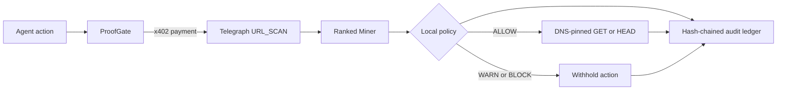

# ProofGate

ProofGate is a pre-execution firewall for autonomous agents. It pays for a live
Telegraph `URL_SCAN` inference, normalizes the selected Miner's result into an
`ALLOW`, `WARN`, or `BLOCK` decision, and only performs the requested network
action when policy returns `ALLOW`.

Every decision is appended to a SHA-256 hash-chained audit ledger. Local
development uses JSONL; serverless deployments use an atomic Redis list. The
same controls are available through the web console, HTTP API, and MCP stdio
server.

## Why this is not another URL scanner

A scanner reports a score. ProofGate enforces a boundary:



ProofGate also exposes its own `URL_SCAN` Miner. That Miner combines URL
structure, DNS, RDAP, and configured reputation providers without visiting the
submitted target URL.

## Current behavior

- Discovers the live Telegraph `URL_SCAN` Miner pool.
- Routes paid scans through Telegraph's `/engine/v1/ask` endpoint.
- Filters x402 requirements by network and maximum amount before signing.
- Treats malicious evidence as `BLOCK` and uncertain evidence as `WARN`.
- Executes only public HTTP(S) targets after `ALLOW`.
- Supports bounded `GET` and `HEAD`; redirects are not followed.
- Stores scan, settlement, and action evidence in an append-only hash chain.
- Requires operator bearer authentication for paid production routes.
- Enforces scoped request limits locally and through Redis when configured.
- Reports unavailable reputation providers as unavailable, never as clean.
- Exposes four MCP tools through the stable MCP v2 stdio SDK.

## Requirements

- Node.js 20 or newer
- npm
- A limited Base Sepolia burner wallet for paid Telegraph calls
- Base Sepolia USDC if the paid application path will be exercised

The free network discovery, local Miner, UI, audit reader, and MCP handshake do
not require a wallet.

## Local setup

```powershell
Set-Location C:\dev\proofgate
& "C:\Program Files\nodejs\npm.cmd" install
Copy-Item .env.example .env.local
& "C:\Program Files\nodejs\npm.cmd" run dev
```

Open [http://localhost:3000](http://localhost:3000).

Configure secrets directly in `.env.local`. Do not paste a private key into an
issue, chat, screenshot, or client-side environment variable.

## Configuration

| Variable | Purpose | Default |
| --- | --- | --- |
| `TELEGRAPH_EVM_PRIVATE_KEY` | Base Sepolia burner key used for x402 signatures | unset |
| `TELEGRAPH_NODE_URL` | Telegraph Engine base URL | `https://devnode.telegraphprotocol.com` |
| `PROOFGATE_MAX_TELEGRAPH_PAYMENT_ATOMIC` | Maximum payment for one Telegraph inference | `100000` |
| `PROOFGATE_MAX_TARGET_PAYMENT_ATOMIC` | Maximum x402 payment for an allowed target | `50000` |
| `PROOFGATE_API_KEY` | Bearer key required by guard and audit routes in production | unset |
| `PROOFGATE_PUBLIC_URL` | Public HTTPS origin embedded in `miner.yaml` | `http://localhost:3000` in the example |
| `PROOFGATE_MINER_ID` | Registration ID emitted in Miner YAML | local placeholder `7402` |
| `PROOFGATE_REPOSITORY_URL` | Public source URL emitted in Miner YAML | unset |
| `PROOFGATE_AUDIT_FILE` | Override the local JSONL ledger path | `data/proofgate-audit.jsonl` |
| `UPSTASH_REDIS_REST_URL` | Persistent audit/rate-limit Redis endpoint | unset |
| `UPSTASH_REDIS_REST_TOKEN` | Redis REST bearer token | unset |
| `KV_REST_API_URL` / `KV_REST_API_TOKEN` | Equivalent names injected by Vercel Marketplace | unset |
| `PROOFGATE_AUDIT_REDIS_KEY` | Redis list used for the audit chain | `proofgate:audit:v1` |
| `PHISHTANK_APP_KEY` | Enables PhishTank evidence | unset |
| `GOOGLE_SAFE_BROWSING_API_KEY` | Enables Google Safe Browsing evidence | unset |
| `URLHAUS_AUTH_KEY` | Enables URLhaus evidence | unset |
| `VIRUSTOTAL_API_KEY` | Enables VirusTotal evidence | unset |

Atomic USDC uses six decimal places. The defaults cap Telegraph at $0.10 and a
target-origin x402 payment at $0.05 per request.

## HTTP API

| Route | Method | Payment | Purpose |
| --- | --- | --- | --- |
| `/api/health` | `GET` | No | Process health |
| `/api/network` | `GET` | No | Runtime readiness and live Miner discovery |
| `/api/miner/scan` | `POST` | No | ProofGate's own provider-backed URL intelligence |
| `/api/guard` | `POST` | Telegraph x402 | Authenticated scan, policy enforcement, and optional execution |
| `/api/audit` | `GET` | No | Authenticated recent records and chain verification |
| `/miner.yaml` | `GET` | No | Dynamic Telegraph Miner declaration |

Example local Miner request:

```powershell
Invoke-RestMethod -Method Post `
  -Uri http://localhost:3000/api/miner/scan `
  -ContentType application/json `
  -Body '{"url":"https://example.com"}'
```

Example guarded action body:

```json
{
  "url": "https://example.com",
  "execute": true,
  "method": "GET"
}
```

Without `TELEGRAPH_EVM_PRIVATE_KEY`, `/api/guard` deliberately returns
`503 payment_not_configured`. It does not substitute mock evidence.

In production, send `Authorization: Bearer <PROOFGATE_API_KEY>` to
`/api/guard` and `/api/audit`. The web console keeps the operator key only in
component memory. Vercel deployments also fail before payment unless both
Upstash Redis variables are configured.

## Vercel deployment

1. Import the public GitHub repository into Vercel or run `vercel` from the
  project root.
2. Add every required variable through Vercel's encrypted environment-variable
  UI. Never commit `.env.local`.
3. Attach an Upstash Redis integration and expose its REST URL and token.
4. Generate a unique operator key and configure `PROOFGATE_API_KEY`.
5. Deploy once, set `PROOFGATE_PUBLIC_URL` to the assigned HTTPS origin, then
  redeploy so `/miner.yaml` contains its canonical public URL.
6. Keep `TELEGRAPH_EVM_PRIVATE_KEY` unset until a fresh, unexposed burner wallet
  is ready.

## MCP server

Build and verify the stdio server:

```powershell
& "C:\Program Files\nodejs\npm.cmd" run mcp:build
& "C:\Program Files\nodejs\npm.cmd" run mcp:smoke
```

The smoke client starts the bundled server, performs the MCP initialization
handshake, lists its tools, calls free live Telegraph discovery, and closes the
child process. The committed `.vscode/mcp.json` points VS Code at
`dist/mcp/server.js`; build the server once before enabling it in an MCP host.

Available tools:

- `proofgate_network_status`: free readiness and live Miner discovery
- `proofgate_scan`: paid Telegraph scan without target execution
- `proofgate_guarded_fetch`: paid scan followed by policy-gated `GET` or `HEAD`
- `proofgate_audit_tail`: recent local decisions with chain verification

The server loads `.env.local` and `.env` from its working directory. stdout is
reserved for MCP JSON-RPC; diagnostics go to stderr.

## Telegraph Miner publishing

1. Deploy the Next.js service at a stable public HTTPS origin.
2. Configure at least the reputation providers intended for production.
3. Set `PROOFGATE_PUBLIC_URL`, `PROOFGATE_REPOSITORY_URL`, and the registration
	ID assigned through Telegraph's integration flow.
4. Verify that `https://your-host.example/miner.yaml` and
	`https://your-host.example/api/miner/scan` are publicly reachable.
5. Validate and submit the emitted YAML through the Telegraph integration
	portal.
6. Confirm the registration and test one paid request in the Explorer before
	announcing availability.

The repository does not claim that a Miner is registered or deployed. Those
steps require a public origin, portal access, and private credentials.

## Verification

```powershell
& "C:\Program Files\nodejs\npm.cmd" run typecheck
& "C:\Program Files\nodejs\npm.cmd" run lint
& "C:\Program Files\nodejs\npm.cmd" test
& "C:\Program Files\nodejs\npm.cmd" run build
& "C:\Program Files\nodejs\npm.cmd" run mcp:build
& "C:\Program Files\nodejs\npm.cmd" run mcp:smoke
& "C:\Program Files\nodejs\npm.cmd" audit
```

See [SECURITY.md](SECURITY.md) for trust boundaries and residual risks.

## Honest limitations

- Telegraph upstream availability can prevent an otherwise valid paid call.
- Reputation coverage depends on which provider keys are configured.
- A clean result is evidence, not a guarantee that a destination is harmless.
- The audit chain is tamper-evident, not encrypted or externally witnessed.
- Redirects are reported but intentionally not followed.
- Miner registration and hackathon submission remain external operator steps.
