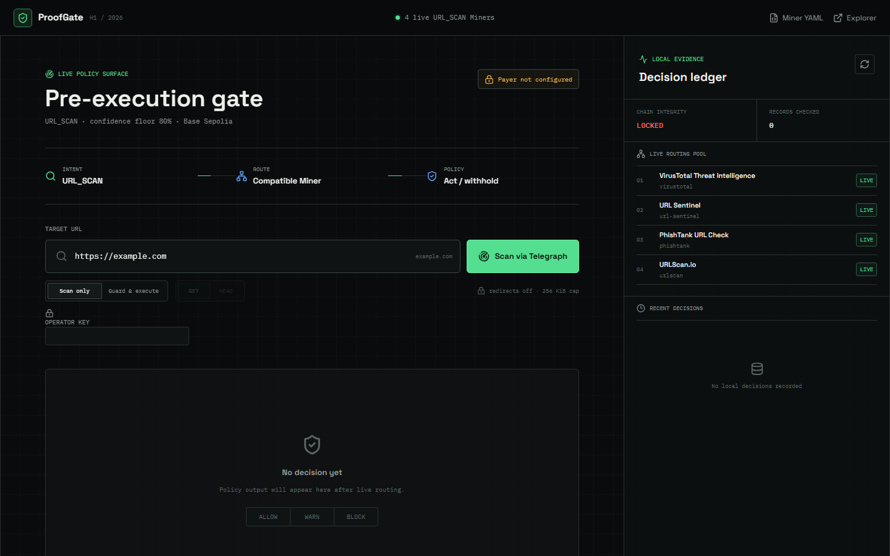
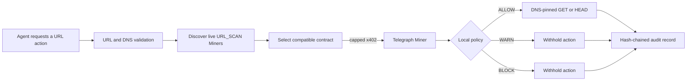
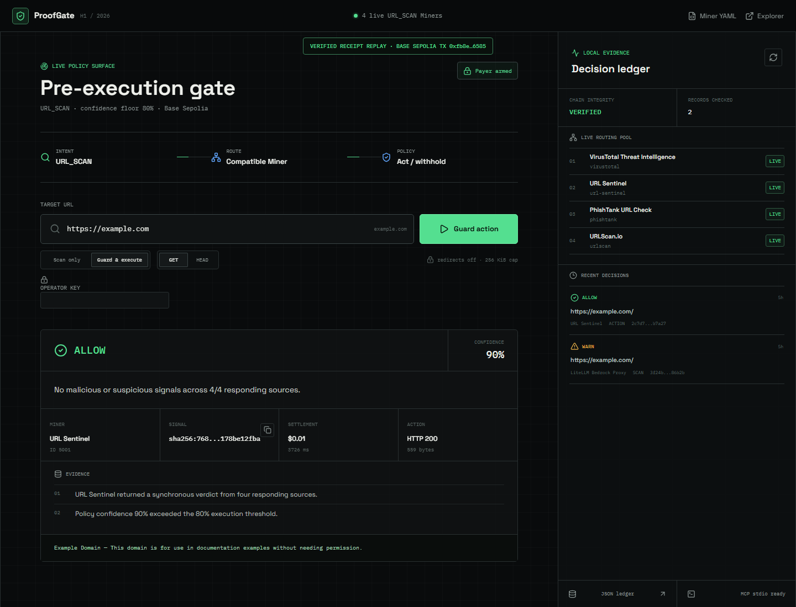
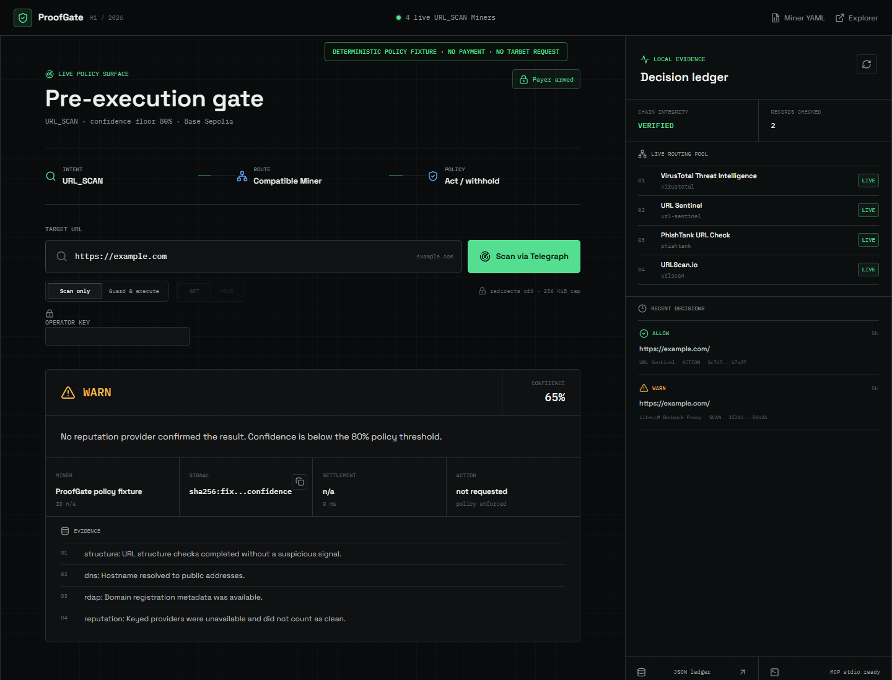
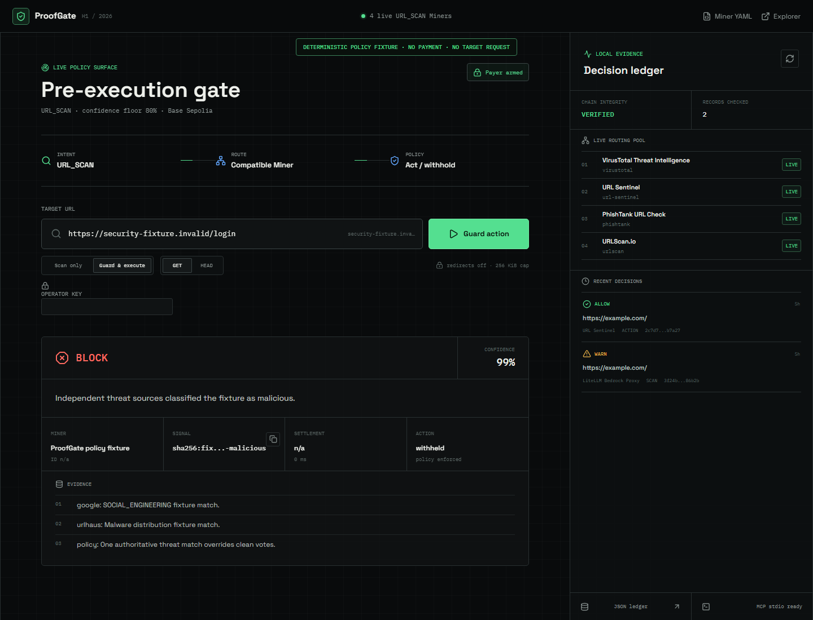
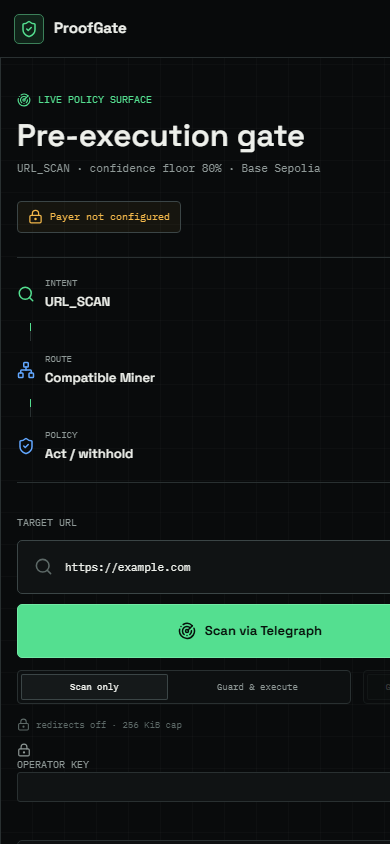

# ProofGate

[](https://github.com/karan68/proofgate/actions/workflows/ci.yml)
[](https://proofgate-six.vercel.app)
[](https://nextjs.org/)
[](https://modelcontextprotocol.io/)
[](https://sepolia.basescan.org/)

**A pre-execution firewall for autonomous agents.** ProofGate buys a URL safety
verdict through Telegraph, applies a local fail-closed policy, and performs the
requested network action only after an `ALLOW` decision. Every decision,
payment receipt, and action result is written to a tamper-evident audit chain.

- **Live console:** https://proofgate-six.vercel.app
- **Miner declaration:** https://proofgate-six.vercel.app/miner.yaml
- **Source:** https://github.com/karan68/proofgate
- **Verified settlement:** [0.01 USDC on Base Sepolia](https://sepolia.basescan.org/tx/0xfb8e49d1eee8d13e7b18707942bbd85f5a99f69dbe41e285ed8fbd21ee316585)

> **Current production safety state:** the public deployment intentionally has
> no payer key (`payment_ready: false`). Discovery, health, the ProofGate Miner,
> Miner YAML, and the console are live. Paid guard execution remains disabled
> until an operator explicitly enables it. The Miner registration transaction
> is prepared and dry-run verified, but has not been submitted.



## Why ProofGate

A URL scanner answers a question. ProofGate enforces a boundary.

Autonomous agents routinely receive links from email, retrieval systems,
tickets, browser tasks, and other agents. A confidence score in a dashboard does
not prevent the next tool call. ProofGate sits on that tool boundary:

1. Normalize and validate the requested public URL.
2. Discover the current Telegraph `URL_SCAN` Miner pool.
3. Select a Miner whose live contract declares synchronous `verdict` and
   `confidence` output.
4. Pay only a compatible Base Sepolia x402 requirement within a hard cap.
5. Normalize the Miner result and apply local `ALLOW / WARN / BLOCK` policy.
6. Execute a DNS-pinned `GET` or `HEAD` only after `ALLOW`.
7. Append the scan, settlement, action, and previous record hash to the ledger.



## What Is Implemented

| Surface | Implemented behavior |
| --- | --- |
| Agent firewall | Scan-only and guard-and-execute modes with `GET` / `HEAD` controls |
| Telegraph client | Live intent discovery, contract-based Miner selection, capped x402 payment, settlement decoding |
| Local policy | Deterministic `ALLOW`, `WARN`, `BLOCK`; unknown or under-confident answers fail closed |
| Guarded executor | Public HTTP(S) only, DNS pinning, TLS SNI preservation, standard ports, manual redirects, bounded bodies |
| ProofGate Miner | Seven evidence sources, deterministic aggregation, no submitted-target fetch |
| Audit ledger | Canonical SHA-256 chain, JSONL locally, atomic Redis compare-and-append in serverless production |
| MCP server | Four MCP v2 stdio tools for status, scan, guarded fetch, and audit tail |
| Web console | Live Miner pool, payment readiness, operator auth, evidence, receipts, execution result, audit history |
| Production controls | Constant-time bearer auth, per-identity distributed limits, security headers, secret-free public deployment |
| Registration | Dynamic Miner YAML plus dry-run-first Base Sepolia registration tooling |
| Continuous verification | GitHub Actions: install, typegen/typecheck, lint, tests, app build, MCP build, dependency audit |

## End-to-End Evidence

### Verified ALLOW and guarded execution

This screenshot is a **replay of the recorded audit receipt**, not a new request.
The underlying run selected Telegraph Miner `5001` (`URL Sentinel`), returned
`safe` at `0.90` confidence, settled exactly `0.01` USDC, executed the pinned
request, received HTTP 200 with 559 bytes, and appended an `ACTION` record.



| Evidence | Verified value |
| --- | --- |
| Intent | `URL_SCAN` |
| Miner | `URL Sentinel` (`5001`) |
| Policy | `ALLOW` at `0.90` confidence; threshold `0.80` |
| x402 | `0.01` Base Sepolia USDC |
| Transaction | [`0xfb8e49d1...ee316585`](https://sepolia.basescan.org/tx/0xfb8e49d1eee8d13e7b18707942bbd85f5a99f69dbe41e285ed8fbd21ee316585) |
| Independent receipt check | Successful receipt in block `45,680,053`; exact `0.01` USDC transfer to Telegraph Diamond |
| Guarded action | `GET https://example.com/` -> HTTP `200`, `559` bytes |
| Audit | `ACTION`, decision `ALLOW`, record hash `2c7d71af...32b7a27` |

### Fail-closed WARN case

This is a **deterministic no-payment fixture** captured with `/api/guard`
intercepted before the request left Chrome. It demonstrates that a nominally
safe result with only `0.65` confidence remains `WARN`; unavailable reputation
providers never count as clean evidence.



### Malicious BLOCK case

This is a **deterministic no-payment fixture** using an invalid fixture domain.
No malicious site was contacted. It demonstrates malicious-source precedence
and confirms that execution is explicitly shown as `withheld`.



### Responsive production UI

The mobile capture is a direct public-production screenshot. No key or payment
was used.



Screenshot provenance and exact reproduction instructions are in
[`docs/VERIFICATION.md`](./docs/VERIFICATION.md).

## Decision Policy

ProofGate does not let a Miner decide whether an action executes. Miners produce
evidence; the local policy owns enforcement.

| Normalized finding | Confidence | Decision | Action |
| --- | ---: | --- | --- |
| `malicious` | any | `BLOCK` | Withheld |
| `suspicious` | any | `WARN` | Withheld |
| `pending` or `unknown` | any | `WARN` | Withheld |
| `safe` | missing | `WARN` | Withheld |
| `safe` | below `0.80` | `WARN` | Withheld |
| `safe` | `0.80` or greater | `ALLOW` | May execute if requested |

Policy option domains are validated. Confidence is finite and bounded to
`[0, 1]`; the VirusTotal harmless-engine threshold must be a non-negative safe
integer.

## Telegraph and x402 Integration

ProofGate deliberately avoids LLM intent classification for enforcement. It
selects from Telegraph's machine-readable integration catalog.

A candidate must declare all of the following before ProofGate can pay it:

- `URL_SCAN` in `supported_intents`
- a synchronous `POST /scan` endpoint
- a `url` input field
- `verdict` and `confidence` output fields
- signal mapping to those fields
- a price no greater than `PROOFGATE_MAX_TELEGRAPH_PAYMENT_ATOMIC`
- a slug other than ProofGate's own Miner, preventing routing loops

The selected endpoint is called through Telegraph's Miner dispatcher using
`@x402/fetch` and `@x402/evm`. Requirements are filtered **before signing**:

- network must equal `eip155:84532`
- amount must be an integer
- amount must not exceed the configured cap

The payment signer uses a dedicated Base Sepolia burner account. x402 uses an
EIP-3009 authorization, so payer gas is not required for inference payments.
The production deployment currently has no signer by design.

## ProofGate URL Intelligence Miner

ProofGate also exposes its own deterministic `URL_SCAN` Miner at
`POST /api/miner/scan`. It does **not** fetch the submitted target URL. It gathers
metadata and reputation evidence instead.

| Source | Always available | Signal |
| --- | --- | --- |
| URL structure | Yes | HTTP, punycode, literal IP, shortener, executable path |
| DNS | Yes | Resolution and public-address validation |
| RDAP | Yes, network permitting | Domain registration age; under 30 days is suspicious |
| PhishTank | With key | Verified phishing database match |
| Google Safe Browsing | With key | Malware/social-engineering threat match |
| URLhaus | With key | Exact malware distribution URL match |
| VirusTotal | With key | Multi-engine malicious/suspicious/harmless counts |

Aggregation is deterministic:

- one authoritative malicious match -> `malicious`, confidence `0.97`
- two or more malicious sources -> confidence `0.995`
- suspicious evidence -> confidence `0.62` or `0.72`
- no clean reputation provider -> safe finding at `0.65` (policy still warns)
- one clean reputation provider -> confidence `0.86`
- two or more clean reputation providers -> confidence `0.96`

Missing, failed, or rate-limited providers are reported as `unavailable` or
`error`. They are never silently converted into clean votes.

Example:

```powershell
Invoke-RestMethod `
  -Method Post `
  -Uri https://proofgate-six.vercel.app/api/miner/scan `
  -ContentType application/json `
  -Body '{"url":"https://example.com"}'
```

## Guarded Network Execution

A scan result alone never opens a socket. Execution begins only after policy
returns `ALLOW` and the caller requested execution.

Security controls:

- only `http:` and `https:` URLs
- embedded credentials rejected
- localhost, metadata hosts, and private hostname suffixes rejected
- private, loopback, link-local, multicast, carrier-grade NAT, and reserved IPs rejected
- every DNS answer validated; one private answer rejects the target
- connection pinned to a validated address while preserving TLS SNI and Host
- standard ports only: HTTP 80 and HTTPS 443
- methods limited to `GET` and `HEAD`
- redirects handled manually and never followed automatically
- default response limit `256 KiB`; hard maximum `1 MiB`
- text preview sanitized and capped at 2,000 bytes
- connection, header, body, and overall request timeouts
- optional target-origin x402 payment subject to its own lower cap

## Tamper-Evident Audit Ledger

Each record contains:

- UUID and timestamp
- `SCAN` or `ACTION`
- normalized target and policy decision
- finding, confidence, reason, and evidence
- Miner ID/name, intent, signal hash, cost, duration, settlement receipt
- execution attempt, HTTP status, bytes, final URL, redirect, preview, error
- `previous_hash`
- `record_hash`

Records are hashed from canonical JSON with sorted object keys.

### Local JSONL

Local development stores newline-delimited JSON at
`data/proofgate-audit.jsonl` unless overridden. Writes are serialized in one
process, and the entire chain is verified before append.

### Production Redis

Vercel uses an Upstash-compatible Redis REST backend. A Lua compare-and-append
operation atomically verifies the current tail hash before `RPUSH`. Independent
instances retry if another writer advanced the chain. Production guard requests
verify storage **before** beginning a paid scan.

The chain detects modification, insertion, deletion from the middle, and
reordering. It is tamper-evident, not encrypted, and cannot independently prove
that the newest tail was not truncated; see [`SECURITY.md`](./SECURITY.md).

## Authentication and Rate Limits

`/api/guard` and `/api/audit` require
`Authorization: Bearer <PROOFGATE_API_KEY>` in production. Comparison is
constant-time after SHA-256 normalization.

| Scope | Limit | Identity |
| --- | ---: | --- |
| Guard | 10 requests/minute | bearer credential + source IP hash |
| Audit | 60 requests/minute | bearer credential + source IP hash |
| Public Miner | 120 requests/minute | anonymous marker + source IP hash |

Redis provides distributed counters in production. Local development uses an
in-memory fallback. Live production verification observed ten schema refusals
followed by two HTTP 429 responses, without reaching Telegraph or payment code.

## HTTP API

| Route | Method | Auth | Rate limit | Payment | Purpose |
| --- | --- | --- | ---: | --- | --- |
| `/api/health` | `GET` | Public | - | No | Version, time, Telegraph readiness, provider flags |
| `/api/network` | `GET` | Public | - | No | Live `URL_SCAN` discovery and runtime policy |
| `/api/miner/scan` | `GET` | Public | - | No | Miner/provider readiness |
| `/api/miner/scan` | `POST` | Public | 120/min | No | ProofGate's metadata/reputation URL scan |
| `/api/guard` | `POST` | Bearer in production | 10/min | Telegraph x402 | Scan, policy, optional execution, audit |
| `/api/audit?limit=50` | `GET` | Bearer in production | 60/min | No | Recent records and chain integrity; max 500 |
| `/miner.yaml` | `GET` | Public | - | No | Dynamic Telegraph Miner declaration |

Guard request:

```json
{
  "url": "https://example.com",
  "execute": true,
  "method": "GET"
}
```

Representative error contracts:

| Status | Error | Meaning |
| ---: | --- | --- |
| 400 | `invalid_request`, `invalid_json`, `unsafe_target` | Input or target rejected before payment |
| 401 | `unauthorized` | Missing or wrong operator bearer key |
| 429 | `rate_limited` | Scope quota exceeded; includes `Retry-After` |
| 502 | `telegraph_request_failed`, `target_execution_failed` | Upstream scan or guarded action failed |
| 503 | `payment_not_configured`, `storage_not_configured`, `operator_access_not_configured` | Required production control is absent |

## MCP v2 Server

ProofGate ships a stable MCP v2 stdio server built with
`@modelcontextprotocol/server`.

| Tool | Payment | Target fetch | Purpose |
| --- | --- | --- | --- |
| `proofgate_network_status` | No | No | Runtime readiness and live Miner pool |
| `proofgate_scan` | Telegraph x402 | No action execution | Intent-bound scan and policy decision |
| `proofgate_guarded_fetch` | Telegraph x402; target x402 if required | Only after `ALLOW` | Guarded `GET` / `HEAD` |
| `proofgate_audit_tail` | No | No | Recent records and chain verification |

Build and run the real client handshake:

```powershell
npm run mcp:build
npm run mcp:smoke
```

The smoke client spawns the bundled server, completes MCP initialization, lists
all four tools, calls live free discovery and audit, checks chain integrity,
and verifies three invalid inputs are rejected. stdout is reserved for JSON-RPC;
diagnostics use stderr.

VS Code configuration is included in [`.vscode/mcp.json`](./.vscode/mcp.json).

## Miner YAML and Registration

`GET /miner.yaml` emits a structured declaration containing identity, endpoint,
input/output schemas, signal mapping, limits, docs, and direct on-chain field
mapping. Non-local public origins must use HTTPS and cannot contain URL
credentials.

Registration tooling follows Telegraph's official permissionless flow against
the current Base Sepolia Diamond:

```powershell
$env:PROOFGATE_MINER_YAML_URL="https://proofgate-six.vercel.app/miner.yaml"
npm run registration:check   # read-only: fetch, hash, validate, check balances
npm run registration:submit  # sends the on-chain registerMiner transaction
```

`registration:check` has been run successfully against the fresh, unexposed
burner wallet:

- `0.0001` Base Sepolia ETH
- `1` testnet USDC
- hosted YAML SHA-256 verified
- all descriptor checks passed
- wallet nonce remained zero after the check
- `ready_to_register: true`

**The registration transaction has not been submitted.** `registration:submit`
is intentionally separate and must be explicitly authorized. The known
chat-exposed test address is hard-blocked by the script.

## Local Development

### Requirements

- Node.js 20 or newer; CI uses Node.js 22
- npm
- optional provider keys for stronger local Miner coverage
- optional dedicated Base Sepolia burner for paid integration testing

```powershell
git clone https://github.com/karan68/proofgate.git
Set-Location proofgate
npm ci
Copy-Item .env.example .env.local
npm run dev
```

Open http://localhost:3000.

Free surfaces work without a wallet. Do not paste secrets into chat, shell
history, screenshots, browser-local storage, or `NEXT_PUBLIC_*` variables.

## Configuration

| Variable | Required | Purpose | Default |
| --- | --- | --- | --- |
| `TELEGRAPH_EVM_PRIVATE_KEY` | Paid scans only | Dedicated Base Sepolia x402 signer | unset |
| `TELEGRAPH_NODE_URL` | No | Telegraph node origin | `https://devnode.telegraphprotocol.com` |
| `PROOFGATE_MAX_TELEGRAPH_PAYMENT_ATOMIC` | No | Per Telegraph payment ceiling | `100000` ($0.10) |
| `PROOFGATE_MAX_TARGET_PAYMENT_ATOMIC` | No | Per target-origin x402 ceiling | `50000` ($0.05) |
| `PROOFGATE_API_KEY` | Production guard/audit | Operator bearer credential | unset |
| `PROOFGATE_PUBLIC_URL` | Publishing | Canonical HTTPS app origin | local request origin |
| `PROOFGATE_MINER_YAML_URL` | Registration script | Exact hosted YAML URL | `<public URL>/miner.yaml` |
| `PROOFGATE_MINER_ID` | Miner YAML | Registration ID placeholder/metadata | `7402` |
| `PROOFGATE_REPOSITORY_URL` | Publishing | Public source URL in YAML | unset |
| `PROOFGATE_AUDIT_FILE` | Local optional | JSONL path override | `data/proofgate-audit.jsonl` |
| `PROOFGATE_AUDIT_REDIS_KEY` | Redis optional | Audit list key | `proofgate:audit:v1` |
| `UPSTASH_REDIS_REST_URL` | Serverless audit | Redis REST URL | unset |
| `UPSTASH_REDIS_REST_TOKEN` | Serverless audit | Redis REST token | unset |
| `KV_REST_API_URL`, `KV_REST_API_TOKEN` | Vercel alternative | Marketplace aliases | unset |
| `PHISHTANK_APP_KEY` | Optional | PhishTank evidence | unset |
| `GOOGLE_SAFE_BROWSING_API_KEY` | Optional | Safe Browsing evidence | unset |
| `URLHAUS_AUTH_KEY` | Optional | URLhaus evidence | unset |
| `VIRUSTOTAL_API_KEY` | Optional | VirusTotal evidence | unset |
| `BASE_SEPOLIA_RPC_URL` | Registration optional | Registration RPC override | public RPC fallback |

## Verification

Current verified baseline:

| Gate | Result |
| --- | --- |
| TypeScript | clean after `next typegen` |
| ESLint | clean |
| Vitest | **74 passed, 0 failed** across 10 files |
| Statement coverage | **83.49%** |
| Branch coverage | **76.19%** |
| Function coverage | **91.34%** |
| Line coverage | **85.96%** |
| Next.js production build | passed; all routes generated |
| MCP build and real stdio handshake | passed |
| npm audit | 0 vulnerabilities |
| Live API parameter matrix | 28/28 expected statuses |
| Production responsive checks | 1440x900 and 390x844, no horizontal overflow |
| Public GitHub CI | [successful run](https://github.com/karan68/proofgate/actions/runs/32233491431) |
| Registration readiness | read-only check passed; no transaction submitted |

Run locally:

```powershell
npm run typecheck
npm run lint
npm test
npm exec -- vitest run --coverage
npm run build
npm run mcp:build
npm run mcp:smoke
npm audit
```

Full evidence, screenshot provenance, live-versus-fixture classification, and
verification commands are in [`docs/VERIFICATION.md`](./docs/VERIFICATION.md).

## Project Layout

```text
.github/workflows/ci.yml             public verification pipeline
.vscode/mcp.json                     local MCP host configuration
mcp/server.ts                        MCP v2 stdio server
scripts/mcp-smoke.ts                 real MCP client handshake
scripts/register-miner.ts            dry-run-first on-chain registration
scripts/capture-readme-screenshots.mjs reproducible no-payment docs captures
src/app/api/*                        HTTP route handlers
src/app/miner.yaml/route.ts          dynamic Miner declaration
src/components/proofgate-console.tsx operations UI
src/lib/proofgate/access.ts          bearer auth and rate limits
src/lib/proofgate/audit.ts           JSONL and atomic Redis audit stores
src/lib/proofgate/execute.ts         DNS-pinned guarded execution
src/lib/proofgate/guard.ts           scan -> policy -> action orchestration
src/lib/proofgate/miner.ts           ProofGate URL intelligence Miner
src/lib/proofgate/policy.ts          normalization and decisions
src/lib/proofgate/redis.ts           Redis REST transport
src/lib/proofgate/target.ts          URL, DNS, IP, and port validation
src/lib/proofgate/telegraph.ts       discovery, selection, x402 dispatch
```

## Deployment

The live deployment uses Vercel with an Upstash Redis integration.

1. Import or deploy the GitHub repository.
2. Configure non-secret public URL, repository URL, node URL, ID, and caps.
3. Attach Redis for persistent audit and distributed rate limits.
4. Generate a strong `PROOFGATE_API_KEY` as a sensitive variable.
5. Redeploy and verify unauthenticated audit returns 401 while authenticated
   audit returns a valid chain.
6. Keep the payer key absent until an operator intentionally enables payments.

The committed [`vercel.json`](./vercel.json) contains no secrets.
`.vercelignore`, `.gitignore`, staged-secret scans, and server-only variables
keep local credentials out of source and deployment bundles.

## Honest Boundaries

- Production payment is currently disabled by choice; the successful paid run is
  historical verified evidence, not a claim that the public instance is funded.
- The ProofGate Miner endpoint is deployed, but the on-chain Miner registration
  transaction has not been submitted.
- Reputation strength depends on configured provider keys. Missing providers
  reduce confidence instead of being counted clean.
- A clean result is evidence, not proof against zero-day threats.
- Redirects are reported and intentionally not followed; the destination must be
  submitted as a new guarded action.
- The audit ledger is tamper-evident, not encrypted or externally witnessed.
- Local JSONL serialization is intended for one process; production uses Redis.
- Telegraph and third-party provider availability remain external dependencies.
- The operator is responsible for key rotation, Redis retention, and protecting
  target URLs that contain sensitive query parameters.

Security and disclosure guidance: [`SECURITY.md`](./SECURITY.md).

## License

No open-source license has been added. All rights remain with the repository
owner unless a license is added later.
